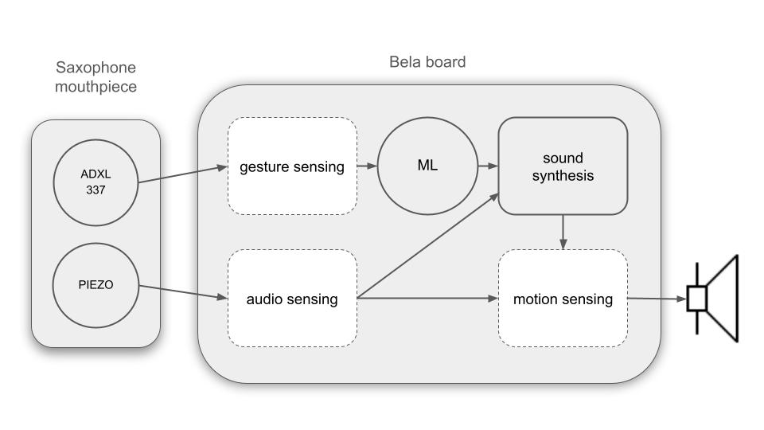

# Saxelerophone

Saxophonists can move their instrument around in space relatively easily when playing. In fact, it is quite common to see this kind of demonstration in live performances. Although these musical gestures demonstrate a certain virtuosity on the part of the performer, they are not directly linked to sound production. 

Based on two important concepts of the field of Interactive Music System (IMS): the *demonstration of virtuosity* and the *spare bandwidth*, we propose the Saxelerophone: a hyper-instrument tracking data from a 3-axis digital accelerometer and a contact microphone to create new interactive sounds for the saxophone. 

||
|:-:|
|Figure 1: The Saxelerophone.|

## Design and implementation

Based on the initial research work carried out on the saxophone and its *musical gestures*, we defined three main objectives for demonstrating gestural virtuosity using the Saxelerophone.

1. Audio sensing for providing information of the notes
played on the instrument.
2. Gesture sensing for the prototyping of mappings strategies
using machine learning.
3. Motion sensing for demonstrating gestural virtuosity.

Sensing objectives are achieved through the use of a [contact microphone](https://www.farnell.com/datasheets/3123697.pdf) and an [ADXL313](https://www.analog.com/media/en/technical-documentation/data-sheets/adxl313.pdf) 3-axis digital accelerometer, positioned one on top of the other on the upper part of the saxophone’s mouthpiece. Sensing data is processed using the visual programming language [Pure Data](http://puredata.info/) (version 0.52.1) and runs on a [Bela board](https://learn.bela.io/products/bela-boards/bela/). 

A functional diagram of the Saxelerophone with its electronic components and how they are connected is presented in Figure 2.

||
|:-:|
|Figure 2: Functional diagram of the Saxelerophone.|

### Gesture-sound mapping

Mapping of the gestures into sound synthesis parameters is performed using machine learning. A schematic representation of the Saxelerophone’s mappings
is presented in the diagram in Figure 3.

||
|:-:|
|Figure 3: Saxelerophone’s mappings.|

A standard regression algorithm is trained to build a new creative sound space for the performer. The algorithm is optimized using the Adam optimizer initialized with a default learning rate of 0.001 and a weight decay of 0.0001. Training of the algorithm is facilitated using the ANN framework for Pure Data called [neuralnet]( https://github.com/alexdrymonitis/neuralnet.git).

## Installation

1. Install the collection of Pure Data abstractions [`SFApdlib`](https://github.com/stefanofasciani/SFApdLib), and copy the folder `sfapdlib` and its contents in the computer and the Bela [Pure Data externals](https://msp.ucsd.edu/Pd_documentation/x4.htm) directory.

2. Install the `pd-externals` [neuralnet] on Bela (external already compiled) and on your computer (compile it or download it).

    * **Bela:** download this [neuralnet](https://uio.instructure.com/courses/46910/files/2457316/download?download_frd=1) folder, unzip it and move it to `/root/Bela/projects/pd-externals/neuralnet` (e.g. use Filezilla).
    * **Computer:**

        1. **Compile the `pd-externals` [neuralnet] on your computer (optional)**

            Ensure you have the [GNU make](https://www.gnu.org/software/make/) (version >= 3.81 required) and download or clone the [`neuralnet`](https://github.com/alexdrymonitis/neuralnet.git) repository.

            * Go to the `neuralnet` folder and run `make` on your terminal
                * if `make` fails it might be because it can't find `m_pd.h`. You can download the file from [here](https://github.com/pure-data/pure-data/blob/master/src/m_pd.h) and put it in the `neuralnet` folder.
                * if `make` succeeds you will find two new files in the neuralnet folder called `neuralnet.pd_xxx` and `neuralnet.pd_xxx.o`, where `xxx` is a string corresponding to your operating system.
                * Open `neuralnet-help.pd` and ensure that all objects load (i.e. no red error message in the PD window).

        2. **Download the `pd-externals` [neuralnet] on your computer**

        * Intel-based mac: download this [neuralnet](https://uio.instructure.com/files/2457350/download?download_frd=1&verifier=UvsZrykkwIA5a2QQGZWH3ji3Oab1eA14mZttXef5) folder, unzip it and move it to your `pd-external` folder.
        * Windows: download this [neuralnet](https://github.com/alexdrymonitis/neuralnet/files/9023594/neuralnet-Windows-i386-amd64.zip) folder, unzip it and move it to your `pd-external` folder.
        * Open `neuralnet-help.pd` and ensure that all objects load (i.e. no red error message in the PD window).
        * Create a sub-folder called `neuralnet` in your `pd-externals` folder, and move all the files inside. 

## Usage
### Training the regression model

Open the `training` folder in this repository, move the [`_main.pd`](training/_main.pd) patch on your Bela and train the regression model with the [`train.pd`](training/train.pd) patch running on your computer. This enables to create new mappings for the Saxelerophone.

### Play with the Saxelerophone!
Move the [`_main.pd`](_main.pd) and [`reg_model.ann`](reg_model.ann) of this repository to your Bela, go to the [settings](https://learn.bela.io/the-ide/settings/) and set the `block size` to 512. Finally, set [`Run on Boot`](https://learn.bela.io/using-bela/bela-techniques/running-projects-on-boot/) and play with the Saxelerophone!

## Contributing
Pull requests are welcome. For major changes, please open an issue first to discuss what you would like to change. Please make sure to update tests as appropriate.

## Acknowledgements
We would like to thank Alexandros Drymonitis from `neuralnet` for open-sourcing his code and publicly releasing checkpoints, and Stefano Fasciani for the useful collection of Pure Data abstractions [`SFApdlib`](https://github.com/stefanofasciani/SFApdLib).

